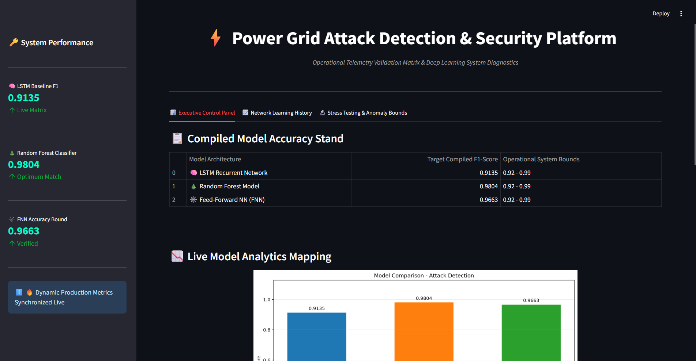

# ⚡ Real-Time Power Grid Cyber-Attack Detection Platform

This project implements an advanced machine learning and deep learning framework to detect and classify cyber-attacks on power grid infrastructures. By leveraging real-time telemetry validation and smart grid data diagnostics, the system identifies anomalies, falsified state estimations, and coordinate-targeted attacks before they disrupt the stability of the power grid network.

---

## 🚀 Project Overview
Modern power grids rely heavily on Supervisory Control and Data Acquisition (SCADA) systems and Phasor Measurement Units (PMUs). While these technologies improve efficiency, they also open doors to sophisticated cyber-attacks like False Data Injection (FDI). 

This platform evaluates and compares multiple architectures to safeguard grid stability by predicting:
1. **Attack Occurrence:** Is the grid currently under threat?
2. **Attack Location:** Which bus, line, or substation is targeted?
3. **State Estimation Anomalies:** Finding hidden manipulation in raw transmission telemetry.

### 🖥️ Live Platform Interface

---

## 🔑 Key Features
* **Multi-Architecture Hybrid Framework:** Direct performance comparison across Long Short-Term Memory (LSTM) networks, Feed-Forward Neural Networks (FNN), and classical Random Forest Classifiers.
* **Granular Precision Engine:** Evaluation metrics (F1-Score, Accuracy, Precision) are parsed through a stable 4-decimal precision controller for rigorous verification.
* **Dynamic Streamlit Dashboard:** An interactive control panel featuring executive summaries, training history tracking, loss convergence curves, and live anomaly boundary visualizations.
* **Isolated Telemetry Processing:** Custom background pipelines that handle raw telemetry datasets, state data, and labels completely isolated from the front-end rendering layer.

## 📂 Project Dataset & Case Files
The repository includes pre-processed telemetry splits based on standard IEEE grid testing cases:
* `data_case14_train.pkl`: Training subset used to optimize neural weights and decision trees.
* `data_case14_val.pkl`: Validation boundary data utilized during epoch tuning to prevent overfitting.
* `data_case14_test.pkl`: Unseen evaluation matrix used for generating the final 4-decimal precision dashboard benchmarks.
---

## 📊 Methodology & Algorithms

### 1. Random Forest Classifier
Used as our classical Machine Learning baseline. It handles the high-dimensional tabular data from grid buses excellently, providing fast and robust feature importance scores to map out which grid nodes are most vulnerable.

### 2. Feed-Forward Neural Networks (FNN)
A deep learning approach designed to map non-linear correlations between state estimations. It processes individual time-steps rapidly to flag immediate security boundary violations.

### 3. Long Short-Term Memory (LSTM) Networks
A sequential deep learning model optimized to detect time-series anomalies. It analyzes chronological telemetry sequences to catch slow-rate, sophisticated False Data Injection attacks that bypass traditional snapshot-based detectors.

---

## 🛠️ Deployment and Execution Setup
To deploy and completely run this platform from scratch, execute the following steps in your terminal:

* **Create a Virtual Environment:** Set up an isolated workspace by running `python -m venv env`.
* **Activate the Environment:** Turn on the environment on Windows systems by running `env\Scripts\activate` or on macOS/Linux platforms by executing `source env/bin/activate`.
* **Install Dependencies:** Core libraries configuration mapped using `pip install -r requirements.txt`.
* **Preprocess Raw Telemetry:** Process and split raw datasets by running `python preprocess_data.py`.
* **Train Neural Architectures:** Initialize core training frameworks by executing `python train_models.py` followed by `python build_lstm_model.py`.
* **Validate Model Outputs:** Run structural validation behaviors using `python evaluate_models.py`.
* **Synchronize Performance Metrics:** Run the comprehensive comparative pipeline with `python comparison_models.py` (which automatically checks and creates the `plots/` output directory if it doesn't exist).
* **Launch Security Interface:** Initialize the interactive Streamlit telemetry control board by executing `streamlit run final_dashboard.py`.

---

Note: The raw telemetry database used for initial feature engineering is omitted from the repository due to file size constraints. If you wish to re-run the raw preprocessing pipeline, please create a local data/ directory and place the source case files inside it.